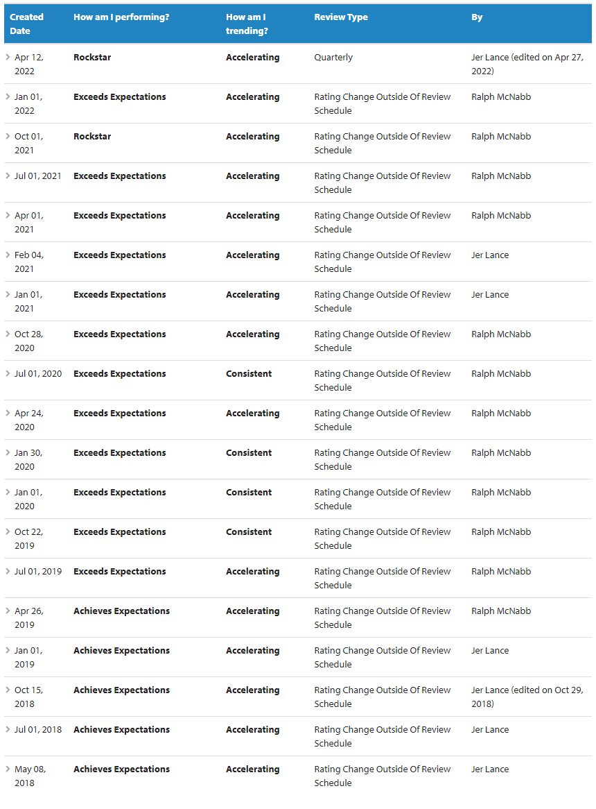

### Profile

### Work history

    #### Rocket Mortgage
<b>Stars of the Month | August 2021</b>  
>As a software engineer, she has been tremendously invested in mentoring her colleagues on her train, especially pushing concepts of quality, testing, and software craftsmanship. She took the lead on the Stock the Pond initiative and helped ensure that we were able to load documents in earlier than expected by a considerable margin. Engineers and leaders alike from across the train consider her to be a go-to person for all thing document transformation, especially the members of the team that are taking over some of their oncall work.  

<b>Team Member of the Month | June 2022</b>  
>Tonya has made an incredible impact not just as a Software Engineer but she has also demonstrated her amazing leadership skills. She has led the team this past month in the absence of her leader, and her efforts and support enabled the entire team to be successful and effective throughout. She not only led major initiatives to the finish line like mitigating security risk findings in Bacon, but has also helped support the team in multiple TIs. One of these was a SEV-3 TI causing considerable impact on our ability to import documents into OnBase. She led the incident to resolution and made sure she notified the impacted clients by involving the right parties at the right time. She also went through the entire BIR process to ensure the team learned from what happened and how to make sure that we do not run into the same issues again. Tonya was able to accomplish all this while contributing to our day-to-day stories on the board! She continues to be a pillar not just for Document Transformation but the entire Documents Platform. Thanks for all your hard work Tonya! 

    ### Synengen

    #### SHC

    #### DeVry Inc.

### Training/Certifications
1. Improve as a mentor: iOKR created with key results around reading a book on mentoring and creating a shared space for mentoring resources.
2. Consolidate [client documentation](https://git.rockfin.com/pages/docs-platform/conversion3-api-guide/) for our merge and convert offerings.
3. Work with the team to eliminate the Process Manager service in Conversion 3.
4. Complete Kubernetes training (scheduled for August 24).

